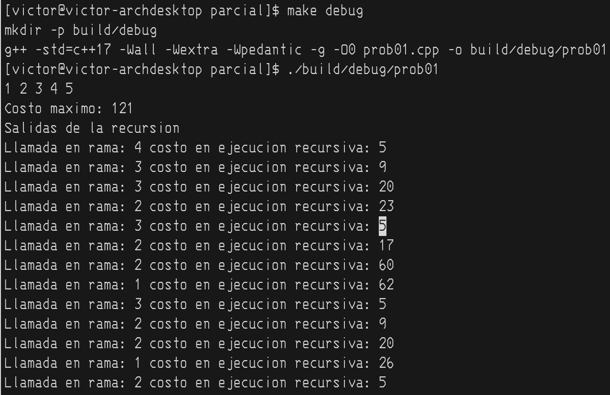
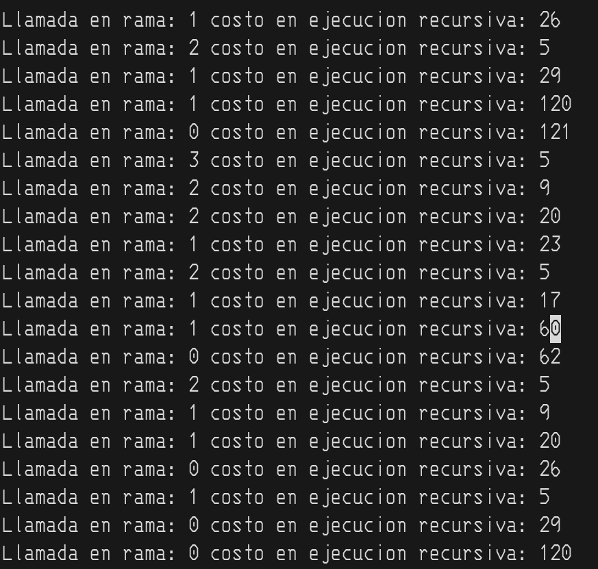
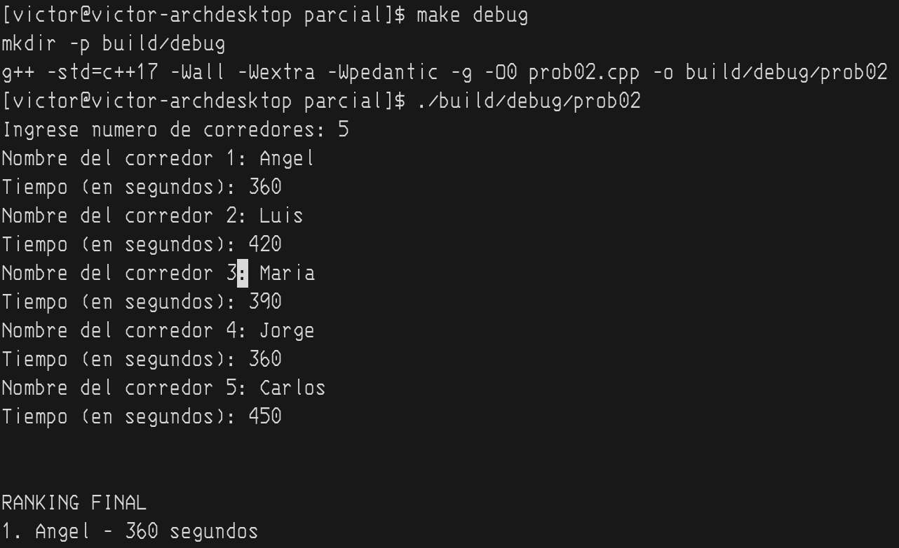
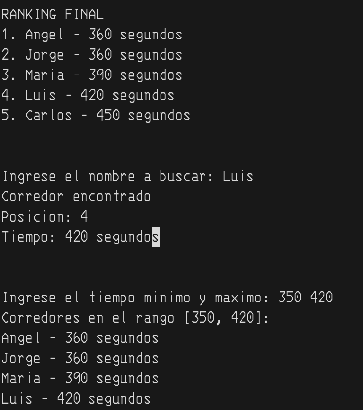
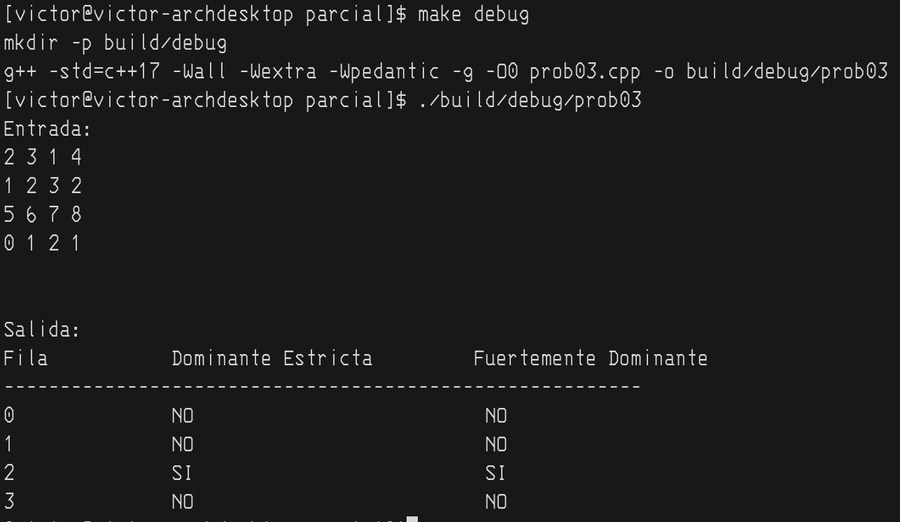
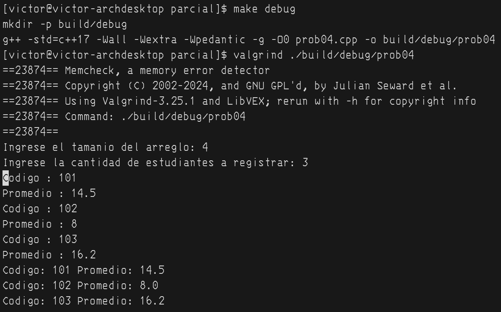
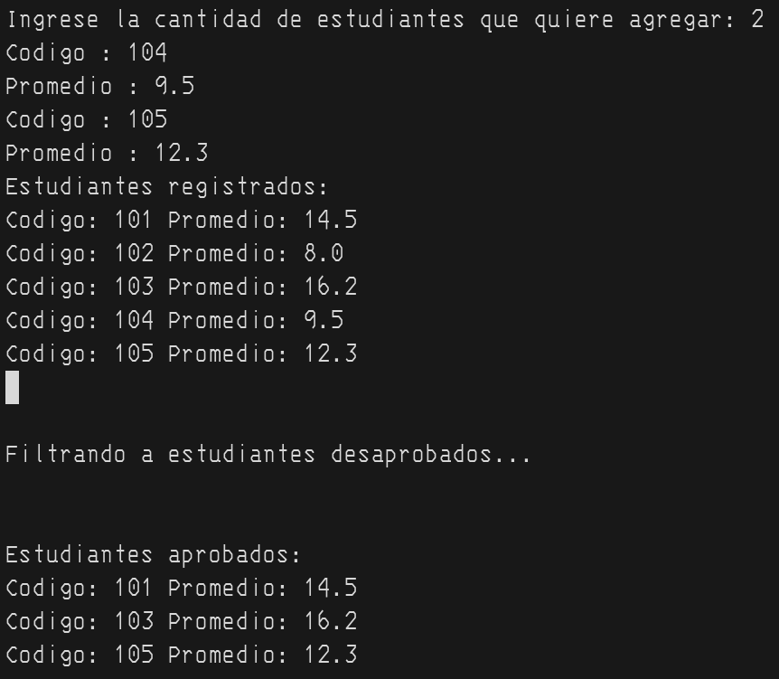
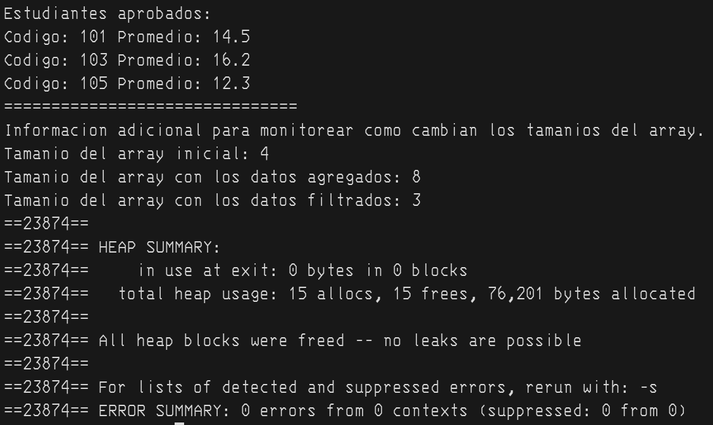

# SOLUCIONARIO EXAMEN PARCIAL

### Estudiante: Victor Hugo Cadillo Gutierrez
### Codigo: 20255514D

## SALIDAS DEL COMPILADOR

### Pregunta 1:

## 1.b.

## El algoritmo recursivo se llama desde un bucle for por lo que se ramifica en varias opciones que luego compara con el costo total para encontrar el valor máximo.

### Pregunta 2:

### Pregunta 3:

### Pregunta 4:

