# SOLUCIONARIO PRACTICA 04

### Estudiante: Victor Hugo Cadillo Gutierrez
### Codigo: 20255514D

## SALIDAS DEL COMPILADOR

### Pregunta 1:

#### Salida con el ejemplo del examen ingresado por consola.

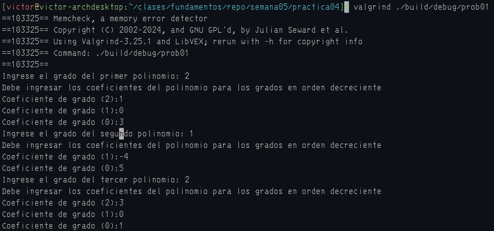
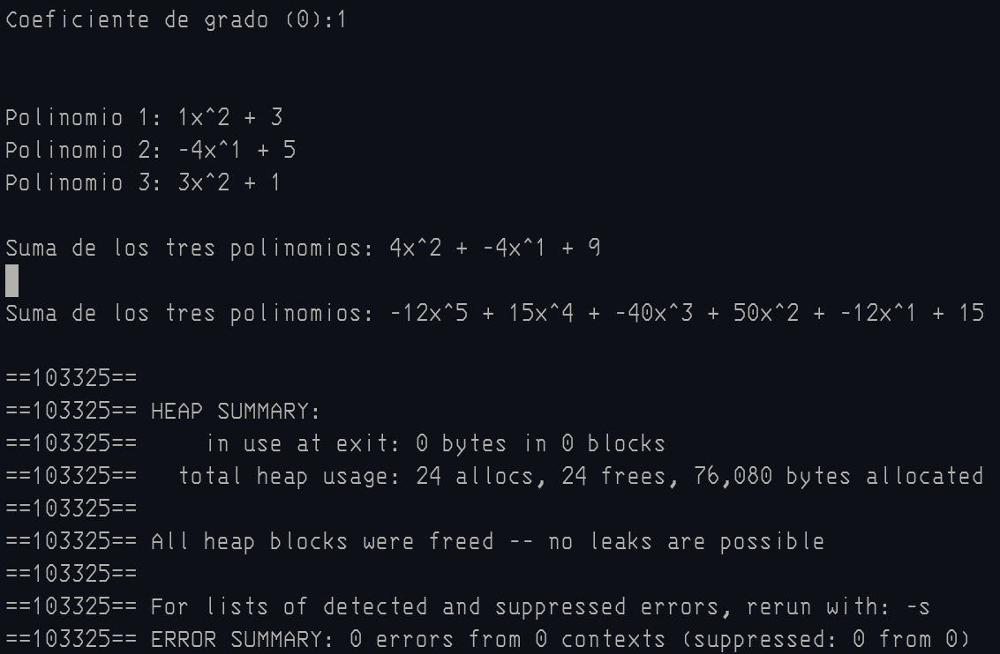

### Salida ejemplo nuevo ingresado por consola.

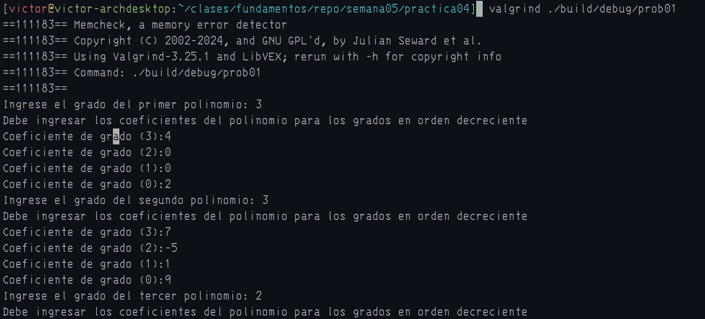
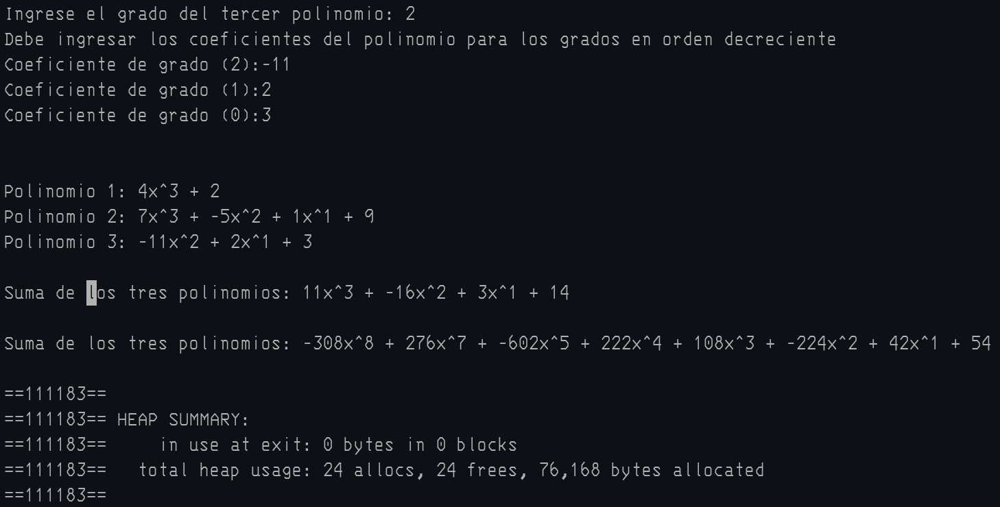
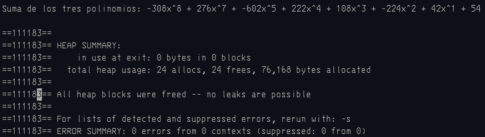

### Pregunta 2:

#### Salida aleatoria 1:

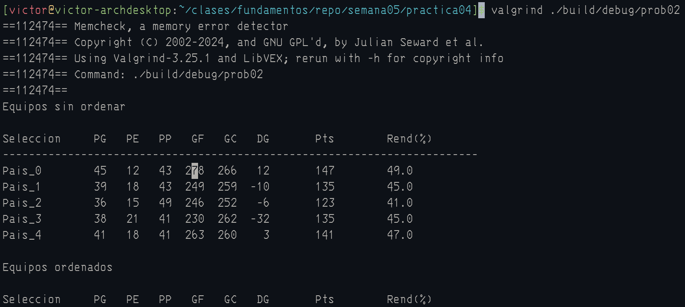
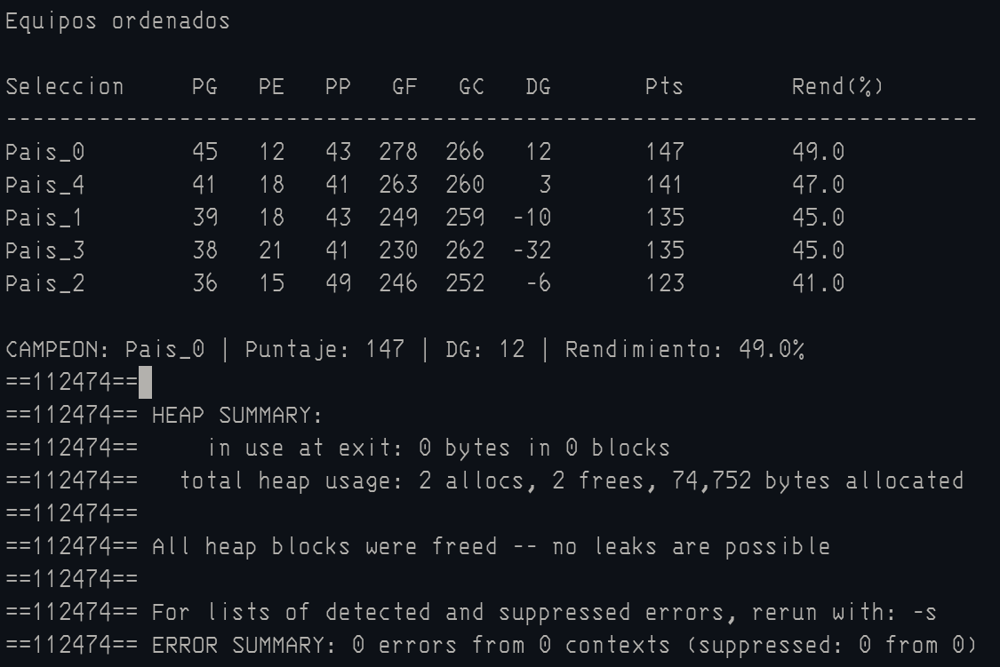

#### Salida aleatoria 2:

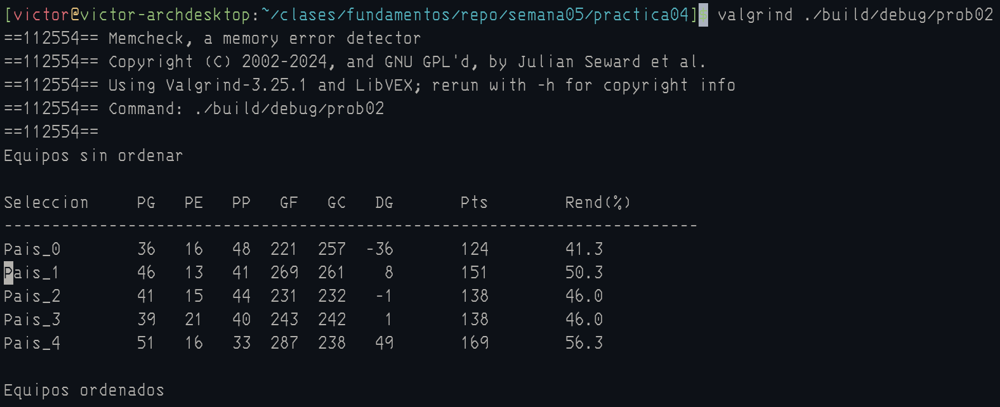
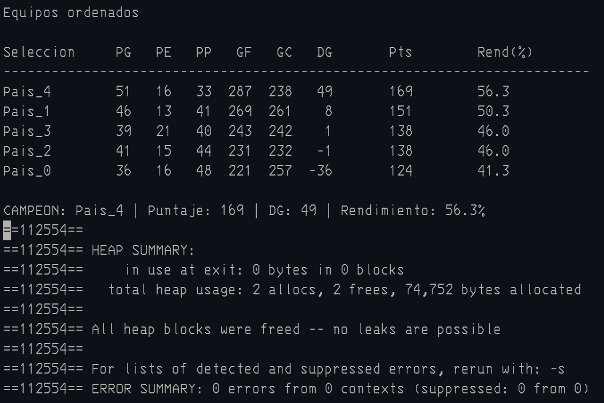

### Pregunta 3:

#### Salida con el ejemplo del examen ingresado por consola.

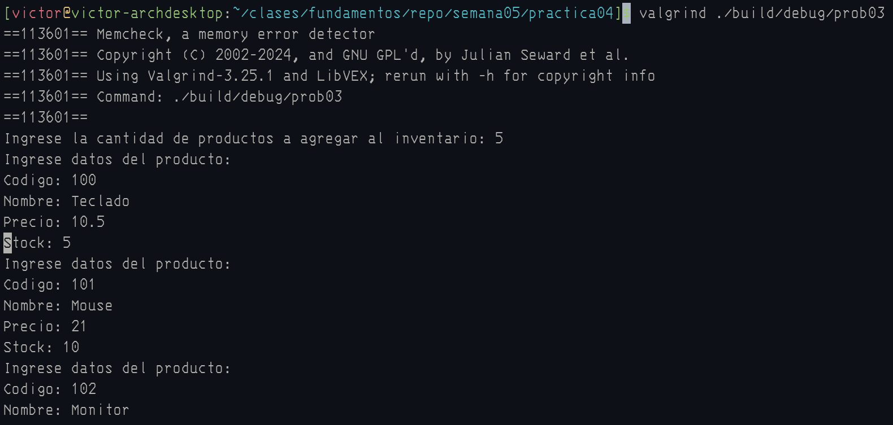
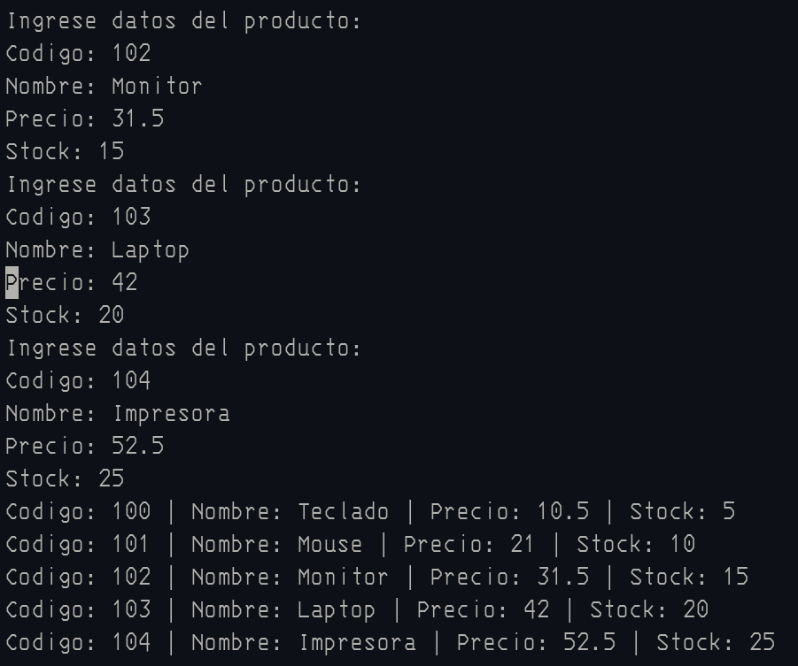

### Salida ejemplo nuevo ingresado por consola.

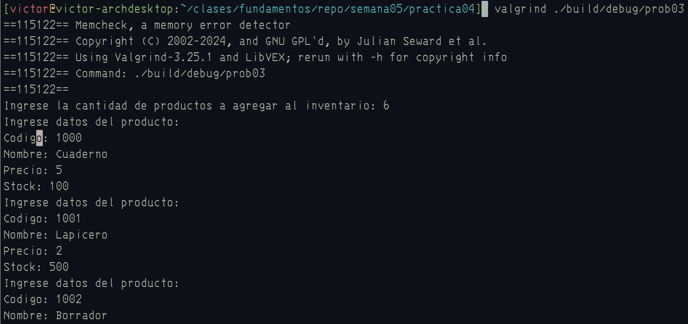
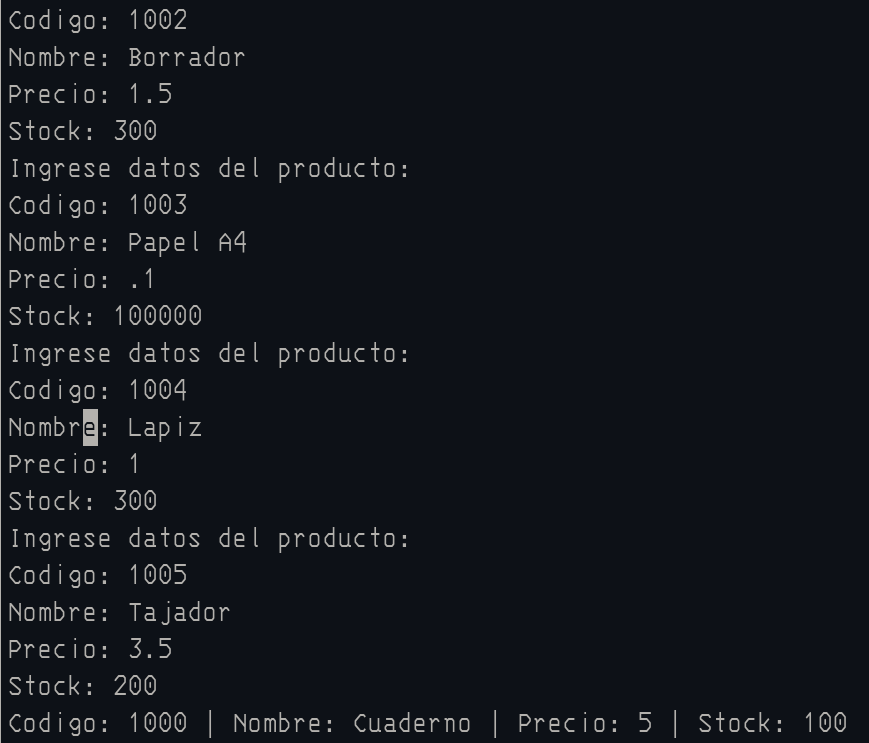

### Pregunta 4:

#### Salida con el ejemplo del examen ingresado por consola.

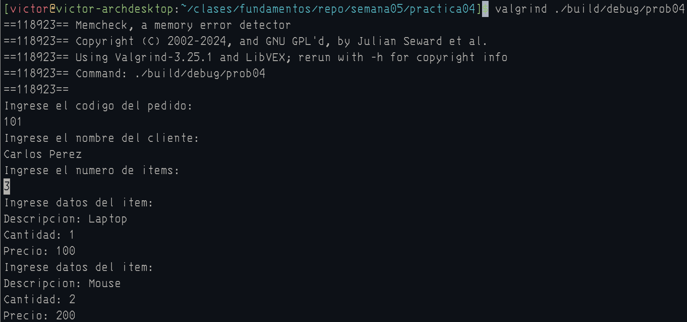
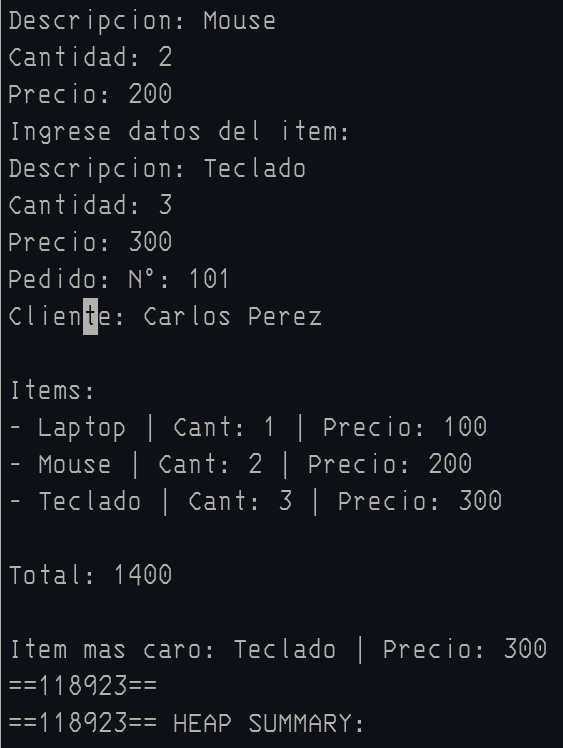
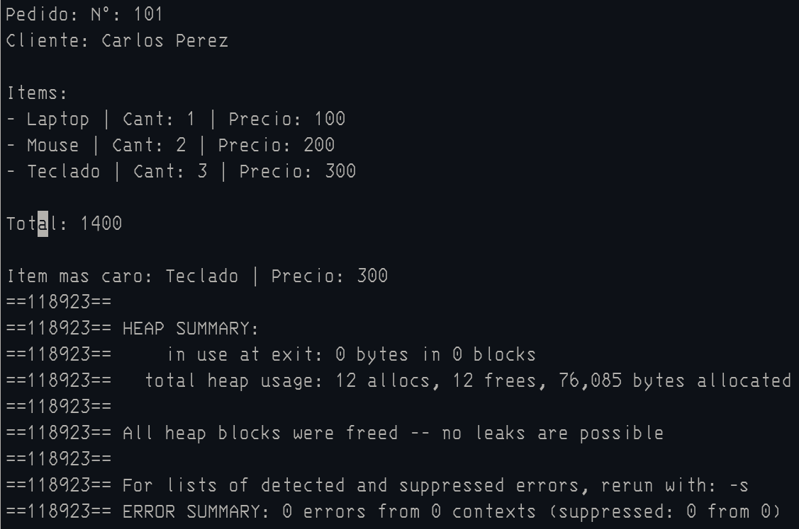

### Salida ejemplo nuevo ingresado por consola.

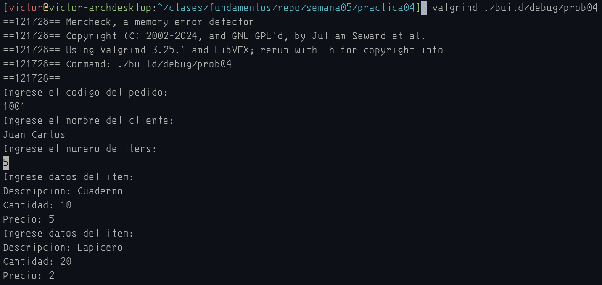
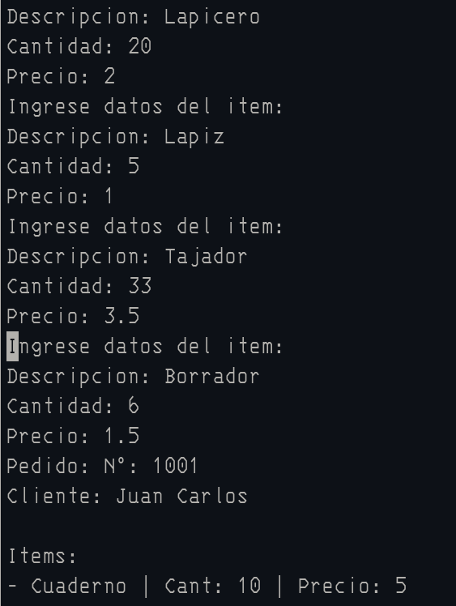
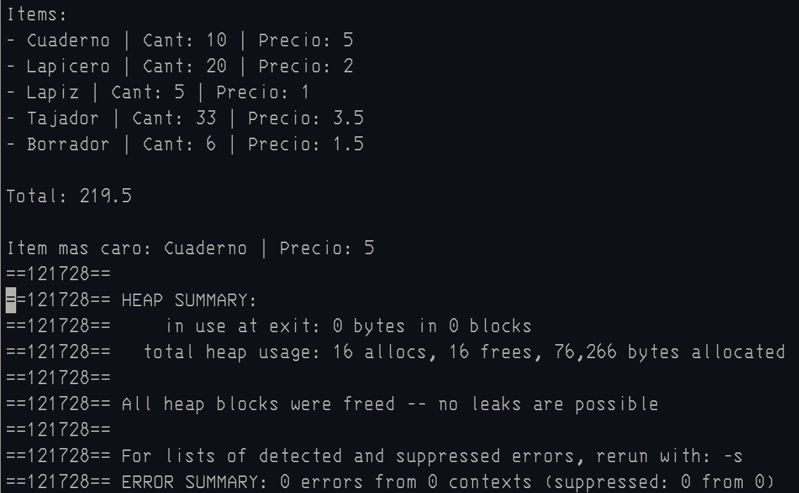
