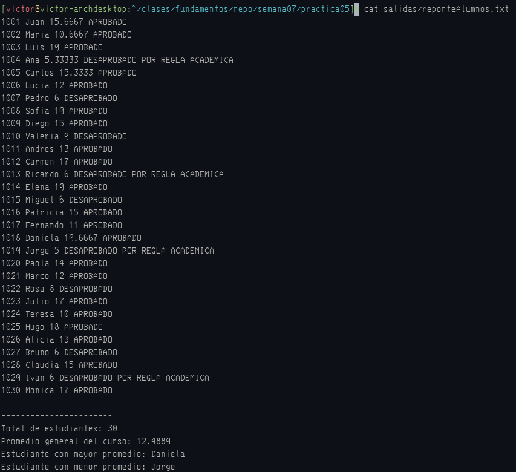
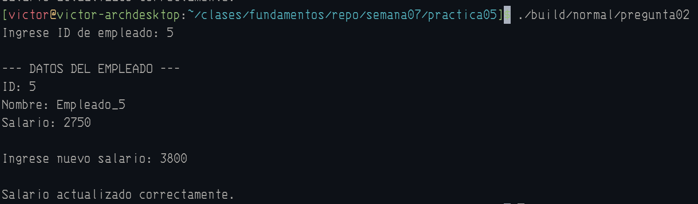
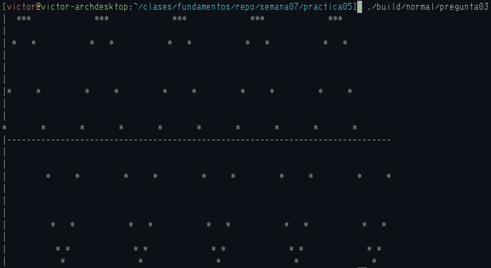
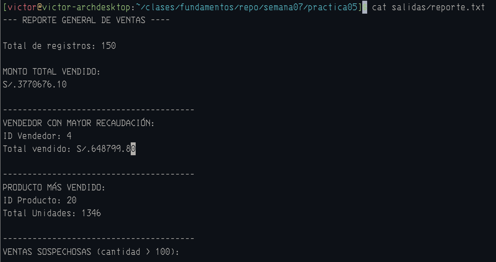
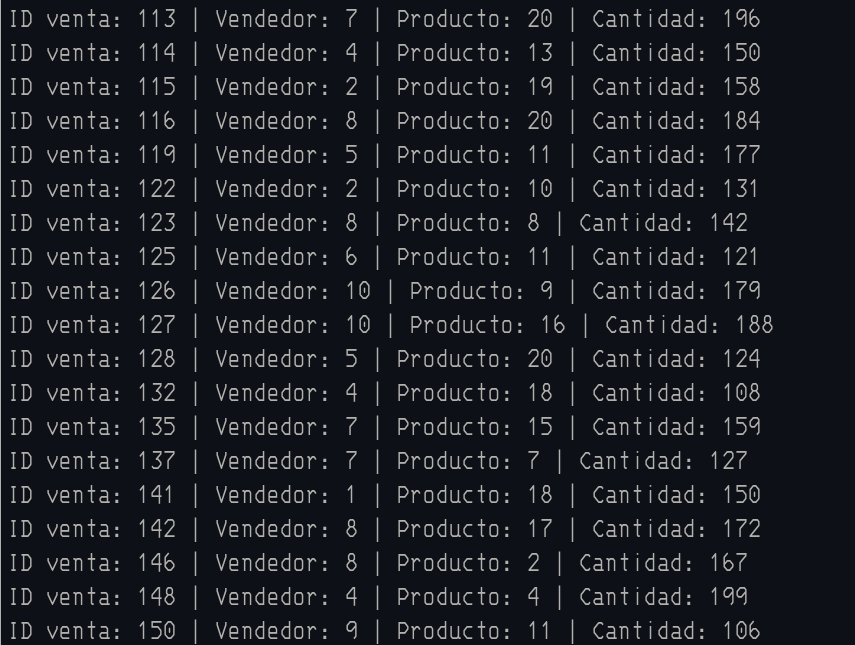

# SOLUCIONARIO PRACTICA 05

### Estudiante: Victor Hugo Cadillo Gutierrez
### Codigo: 20255514D

## SALIDAS DEL COMPILADOR

## Pregunta 1:

#### Archivo completo en:

[reporteAlumnos.txt](salidas/reporteAlumnos.txt)

## Pregunta 2:

## Pregunta 3:

#### Archivo completo en:

[grafico.txt](salidas/grafico.txt)

## Pregunta 4:

#### Archivo completo en:

[reporte.txt](salidas/reporte.txt)

#### Inicio del archivo:

#### Final del archivo:

